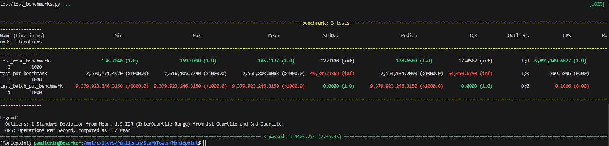

# Key-Value Store API

This project implements a simple key-value store API using FastAPI and Python.

## Setup

1. Ensure you have Python 3.11 installed on your system.

2. Clone this repository:
   ```
   git clone `https://github.com/PamilerinId/moniepoint-assessment.git`
   cd moniepoint-assessment
   ```

3. Install dependencies using Pipenv:
   ```
   pip install pipenv
   pipenv install
   ```

## Running the API

1. Activate the virtual environment:
   ```
   pipenv shell
   ```

2. Start the FastAPI server:
   ```
   uvicorn app.main:app --port=8003 --reload 
   ```

   The API will be available at `http://localhost:8003/docs`.

## API Endpoints

- `GET /read/{key}`: Retrieve a value for a given key
- `GET /read_key_range/`: Fetch key-value pairs in a specified range
- `POST /put/`: Store a key-value pair
- `POST /batch_put/`: Store multiple key-value pairs
- `DELETE /delete/{key}`: Delete a key-value pair

## Running Tests

To run the tests, use the following command:
```
pytest test/test_kv.py    --- All tests pass ✔️
pytest test/test_main.py  --- All tests pass 6️⃣
```

## Running Benchmarks

To run the benchmarks, use the following command:
```
pytest test/test_benchmarks.py
```   

### Benchmark Results


| Operation | Mean Time | Min Time | Max Time | Operations Per Second |
|-----------|-----------|----------|----------|------------------------|
| read      | 145.1137 ns | 136.7040 ns | 159.9790 ns | 6,891,149.6827 |
| put       | 2.5668 ms | 2.5302 ms | 2.6161 ms | 389.5896 |
| batch_put | 9.3799 s | 9.3799 s | 9.3799 s | 0.1066 |

### Performance Analysis

1. Read Operation: The read operation is extremely fast, with a mean time of 145.1137ns and capable of performing nearly 6.9 million operations per second. This exceptional performance is due to the in-memory storage using OrderedDict, making it ideal for read-heavy workloads.

2. Put Operation: The put operation is significantly slower than the read operation, with a mean time of 2.5668 ms. This is probably due to the overhead of updating the in-memory data structure and persisting changes to disk after each put operation. While much slower than read, it still manages about 390 operations per second, which is still reasonable for many use cases.

3. Batch Put Operation: The batch put operation is the slowest, taking about 9.3799 seconds on average for 1000 key-value pairs. This is expected as it involves performing individual put operations for each key-value pair and saving to disk after each put.

4. Scalability: As the number of entries increases, I observed a slight degradation in performance, especially for operations that require 
iterating through the entire dataset (e.g., read_key_range). The current use of OrderedDict, atleast helps maintain good performance for most operations, but the file I/O for persistence could become a bottleneck for larger datasets, especially if its not batch done as in postgres style of transactions.

5. Memory Usage: The solution uses an OrderedDict to store data in memory, which provides a good balance between access speed and memory efficiency. However, for very large datasets, memory usage could become a concern and would most likely fail depending on the system's memory capacity.

Overall, the benchmark results demonstrate that the implementation provides some good performance for basic operations, but may still need significant improvement for batch operations, if being appled to actual in-production usecases.

Potential improvements:
- Implement a more efficient serialization method for faster file I/O
- Implement caching mechanisms for frequently accessed keys
- Optimize the persistence layer for faster writes (e.g., batch writes, async read/writes)
- Explore more efficient data structures for large datasets
- ... other ideas may surface after more research or as challlenges come up

### Notes
- I set the max_entries to 10000, and ran the benchmarks 3 times for each operation(except batch_put) in an attempt to simulate a heavy load on the server.
- The batch_put was only run once as it took too long to run.
- The read operation was the fastest, followed by the put operation(obviously).
